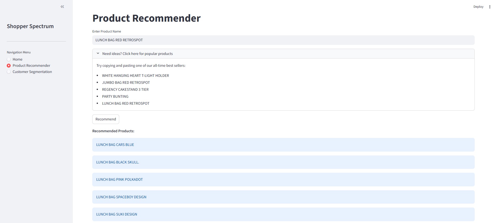
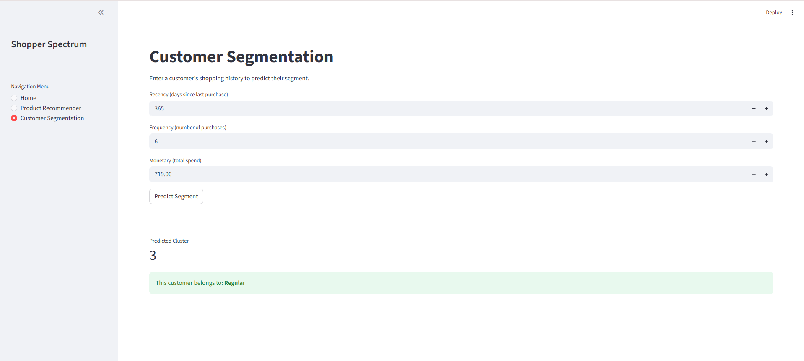
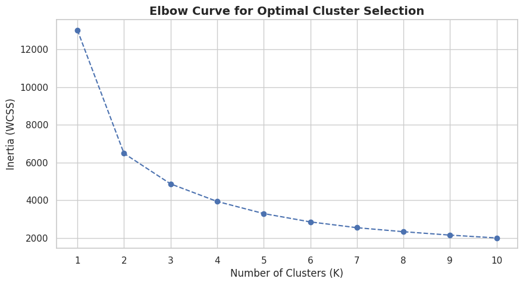
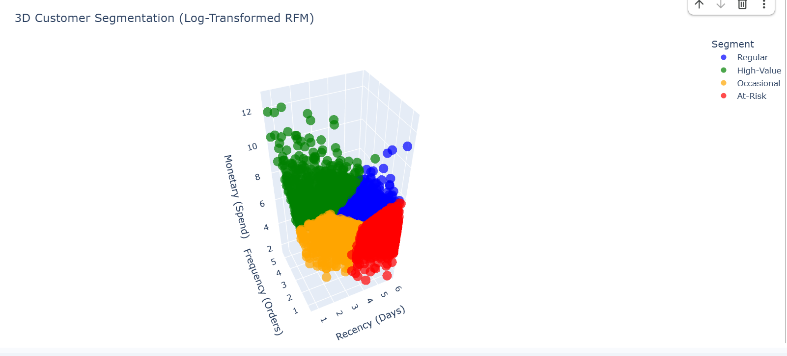

# 🛒 Shopper Spectrum: E-Commerce Analytics & Recommendation Engine

Shopper Spectrum is an end-to-end Machine Learning web application designed to help e-commerce businesses understand their customers and drive sales. It combines Unsupervised Learning for customer segmentation with Collaborative Filtering for targeted product recommendations.

## 🚀 Key Features

### 1. Product Recommendation Engine
An item-based collaborative filtering system. By calculating the Cosine Similarity across thousands of products based on historical purchasing data, the app instantly recommends the top 5 items most frequently bought with any searched product.
*(Customers who bought this, also bought...)*

### 2. Customer Segmentation (RFM Analysis)
A K-Means clustering algorithm that evaluates a customer's Recency, Frequency, and Monetary (RFM) metrics to categorize them into actionable business profiles:
* **High-Value:** Frequent, high-spending VIPs.
* **Regular:** Steady, reliable shoppers.
* **Occasional:** Low frequency, seasonal buyers.
* **At-Risk:** Formerly active shoppers who haven't purchased recently.

## 🛠️ Tech Stack
* **Data Science & ML:** Python, Pandas, NumPy, Scikit-Learn
* **Visualization:** Matplotlib, Seaborn, Plotly (3D Interactive)
* **Web Framework:** Streamlit
* **Deployment:** Local Virtual Environment

## 🔬 Behind the Scenes (Data Science Pipeline)
Before building the app, the raw transactional data underwent rigorous preprocessing:
1. Data cleaning and handling of missing/canceled orders.
2. Exploratory Data Analysis (EDA) to uncover geographical and product trends.
3. RFM metric calculation and Log-Transformation to handle extreme outliers.
4. Standardization and optimal cluster selection using the Elbow Method and Silhouette Score.

